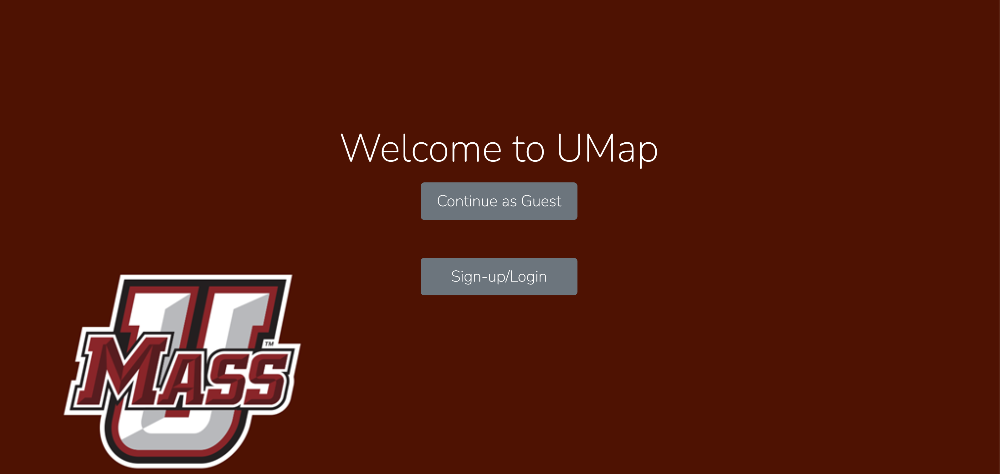
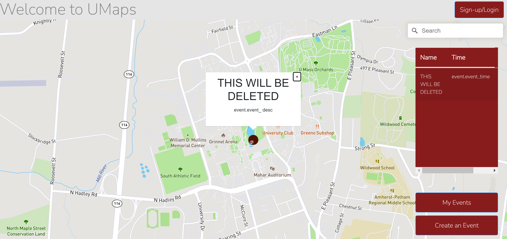
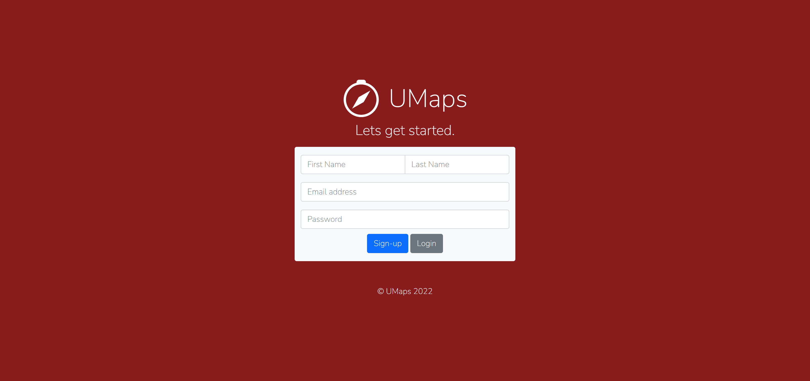
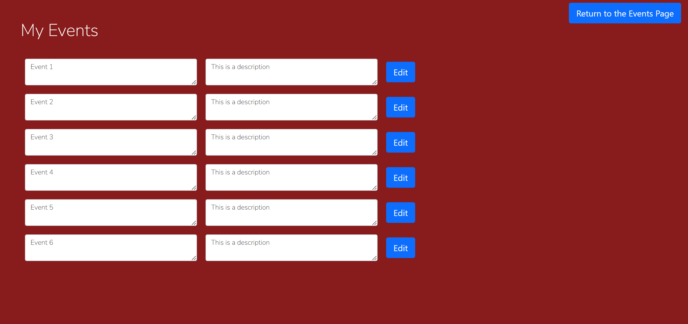
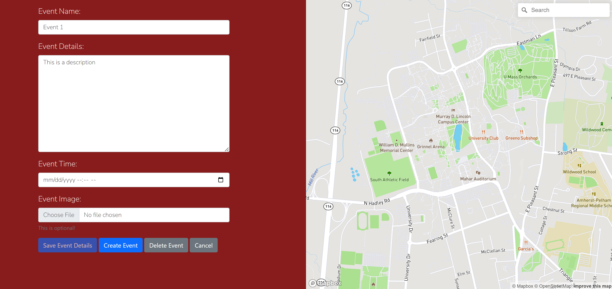

# Team Name - Kirkland Signature

## UMap
## Spring 2022
## Overview:
We created a live event map for the UMass Amherst campus. It allows users to create, find, and rsvp to events that are displayed on the map. The website currently allows users to sign in or view it as guests. If they are a guest they can only view existing events. If they are signed in, they can view, create, and rsvp to events. In addition they can edit or delete events that they have created.
## Team Members
Rishab Mehta - rwmehta
Suyash Deshmukh - Suyash-Deshmukh
Alex Qiu - qiu-alex
Paul Shi - Stein0827
## User Iterface

| UI View | Description  |  Images |
|---------|---|---|
|    Landing Page     |  Viewers can choose to continue as a guest or sign in. |   |
|     Map    | Shows the map with markers on it to signify events. When clicked on, these markers display pop ups as shown in the image. There is a table to the side with all the events, and a button that allows users to view more details. The more details button is not shown in this image because you have to scroll over in the events table to see it. There is an option to sign up, search for an address, view your events, and create an event. Viewing your events and creating events only work if signed in.  |   |
|    Login     | This is where the Sign-up/Login buttons redirect you to. You can either log in if you are an existing user or select sign up to register.  |   |
|     Register    |  This allows new users to register. |   |
|     My Events    |  This allows users to view events they have created and edit them. |   |
|    Event Creator     | This page allows users to create events. If the edit button on my events is clicked it will redirect here and populate this with the existing event.  |   |
|     Event Viewer    |  This page allows users to view an event from the main map page when they click the details button in the table. This is a readonly page, so users cannot edit an event from here. |   |

## APIs
| Event                      | description                                                                                                                                                                                                                              | User                                               | description                                                                                                                                                                       |
|----------------------------|------------------------------------------------------------------------------------------------------------------------------------------------------------------------------------------------------------------------------------------|----------------------------------------------------|-----------------------------------------------------------------------------------------------------------------------------------------------------------------------------------|
| createEvent(event)         | The event parameter takes in an event object that contains host_id, host_name, event_name, event_desc, event_location, event_time, and attendees. The function uses POST method to  create an new event.                                 | createUser(first_name, last_name, email, password) | All parameters are strings and it creates a new user on MongoDB  via POST method.                                                                                                 |
| readEvent(id)              | The parameter is the MongoDB objectID() type and the function finds and returns the event with the unique ID. The function uses GET method.                                                                                              | readUser(id)                                       | The parameter is the MongoDB objectID() type and the function finds and returns the user with the unique ID. The function  uses GET method.                                       |
| updateEvent(event)         | The event parameter takes in an event object that contains host_id, host_name, event_name, event_desc, event_location, event_time, and attendees. The function updates the event with the new event object. The function uses PUT method | updateUser(user)                                   | The user parameter is a User object that contains user_name, user_email, and user_password. The function updates the user with the new user object. The function uses PUT method. |
| updateRSVP(event, user_id) | The RSVP function updates the attendees list in the Events object using the event object parameter and user_id parameter. The function uses PUT method.                                                                                  | deleteUser(id)                                     | The id parameter is the MongoDB objectID() type. The function uses the id to find the user in the database and deletes it. The function uses DELETE method.                       |
| deleteEvent(id)            | The id parameter is the MongoDB objectID() type. The function uses the id to find the event in the database and deletes it. The function uses DELETE method.                                                                             |                                                    |                                                                                                                                                                                   |

## URL Routes/Mappings
| URL routes    | description                                                                                                                                       |
|---------------|---------------------------------------------------------------------------------------------------------------------------------------------------|
| /login        | redirects the client to the login page.                                                                                                           |
| /map          | redirects the client to the map page to view the overall map and all the events.                                                                  |
| /event-editor | redirects the client to the event editor page.  The user is allowed to change the event page.  Requires authentication for editing event details. |
| /my-event     | redirects the client to the my events page. The  page allows the users to view all the events they created. requires authentication.              |
| /event-viewer | redirects the clients to the event viewer page. The  page allows the user/guest to view the details of the event.                                 |
| /logout       | logs out the current user from the session.                                                                                                       |
| /register     | calls the /createUser route. Creates a new user.                                                                                                  |
| /getUserById  | Make a query to find the user using the mongodb ObjectID.                                                                                         |
| /createEvent  | Creates a new event.                                                                                                                              |
| /editEvent    | Update/edit an event.                                                                                                                             |
| /deleteUser   | deletes an existing user.                                                                                                                         |
| /deleteEvent  | deletes an existing event.                                                                                                                        |
| /getEventById | Make a query to find the event using the mongodb ObjectID.                                                                                        |
| /getAttendees | returns a list of attendees of a given event.                                                                                                     |
| /attendEvent  | RSVP to an event.                                                                                                                                 |
## Authentication/Authorization

We are working on authentication. Only signed in users are allowed to create, rsvp, delete, and edit events.

## Division of Labor

### Milestone 1
- Rishab:
Researched on map APIs, made the maps on the main page and the event creator page. Made wireframes. Worked on the my-events page.

- Paul:
Made the landing page. Worked on wireframes. Worked on the main map page.

- Alex:
Made the sign-up and login pages. Worked on wireframes.

- Suyash:
Made the milestone1.md file. Worked on wireframes. Made Event Creator Page. Worked on the my-events page.

### Milestone 2
- Rishab:
Front end implementation. Debugging with postman. API documentation. Worked on milestone2 document.

- Paul:
Front end implementation. Some CRUD functions in server.js. API documentation. Worked on milestone2 document. Deployed web app on Heroku

- Alex:
ExpressJS CRUD functions in server.js. API documentation. Worked on milestone2 document. Some front end implementation.

- Suyash:
Database.js file. CRUD functions in server.js. API documentation. Worked on milestone2 document. Debugging with postman.

### Milestone 3

- Rishab: 
Worked on authentication and the CRUD functions of MongoDB integration, worked on front end integration, worked on documentation. Debugging.

- Paul: 
Worked on documentation and CRUD functions of MongoDB integration, worked on documentation. Debugging.

- Alex: 
Worked on authentication and CRUD functions of MongoDB integration. Debugging.

- Suyash: 
Worked on authentication and CRUD functions of MongoDB integration, worked on documentation. Debugging.

## Conclusion

Our website has been deployed to Heroku and can be accessed through the following link:
https://cs326-final-umap.herokuapp.com/

We enjoyed working together, and found that it was very useful to be in person. It allowed us to both implement and debug much faster then we would have otherwise been able to. We learnt a lot about map APIs and Express. This was our introduction to Bootstrap and Node.js. We gained a lot of experience with backend implementation and MongoDB integration. We encountered grave difficulties when attempting to implement authentication. We spent an approximate 30 hours on authentication were not able to make it functional so we could not include it in our final release. We would have liked to know how difficult connecting to a database and authentication would be before starting the project so we could have planned out our last milestone better. Overall, it was an interesting project to work on, and we believe it is a useful web app.