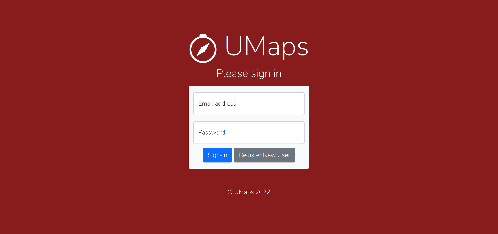
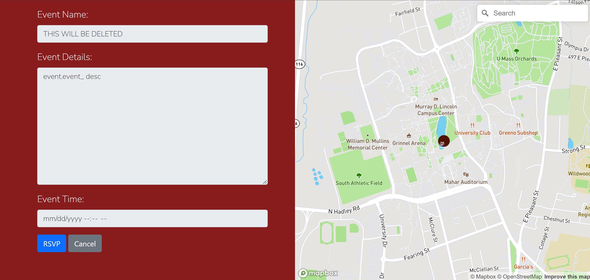

# team name - Kirkland Signature

## UMap
## Spring 2022
## Overview:
We created a live event map for the UMass Amherst campus. It allows users to create, find, and rsvp to events that are displayed on the map. The website currently allows users to sign in or view it as guests. If they are a guest they can only view existing events. If they are signed in, they can view, create, and rsvp to events. In addition they can edit or delete events that they have created.
## team members
## user iterface

| UI View | Description  |  Images |
|---------|---|---|
|    Landing Page     |  Viewers can choose to continue as a guest or sign in. |   |
|     Map    | Shows the map with markers on it to signify events. When clicked on, these markers display pop ups as shown in the image. There is a table to the side with all the events, and a button that allows users to view more details. The more details button is not shown in this image because you have to scroll over in the events table to see it. There is an option to sign up, search for an address, view your events, and create an event. Viewing your events and creating events only work if signed in.  |   |
|    Login     | This is where the Sign-up/Login buttons redirect you to. You can either log in if you are an existing user or select sign up to register.  |   |
|     Register    |  This allows new users to register. |   |
|     My Events    |  This allows users to view events they have created and edit them. |   |
|    Event Creator     | This page allows users to create events. If the edit button on my events is clicked it will redirect here and populate this with the existing event.  |   |
|     Event Viewer    |  This page allows users to view an event from the main map page when they click the details button in the table. This is a readonly page, so users cannot edit an event from here. |   |

## APIs
## URL Routes/Mappings
## Authentication/Authorization
## Division of Labor
## Conclusion

Our website has been deployed to Heroku and can be accessed through the following link:
https://cs326-final-umap.herokuapp.com/