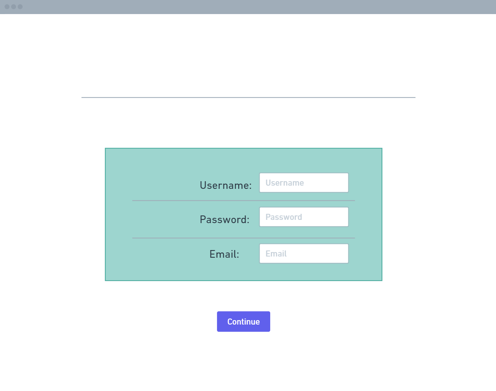
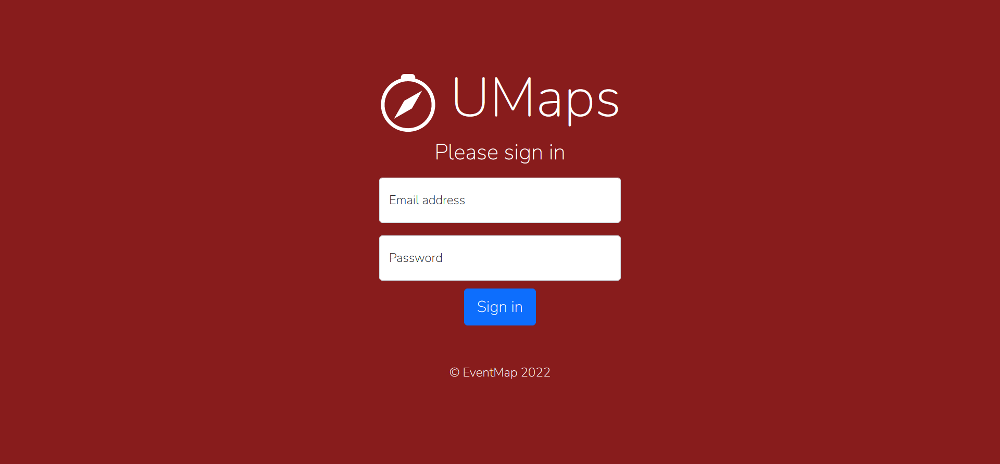
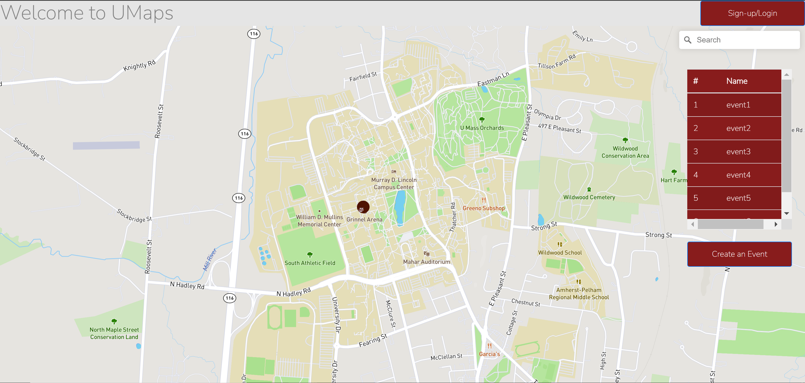

# Part 0: Data Interactions
2 types of Users: Signed-In users and Signed-Out users.
- Map is shown on main page irrespective of user type.
- Map has pins, which can be clicked on by any user to open a pop-up with information about the event they clicked on.
- Each event has multiple types of data: the event title, description, location (address), time of event, and image(s), visible to all types of users.
- Signed-In Users can go to event creator page to be able to edit all of the above data types for events they have made. 
- Each event will have number of people already RSVPed for the event, shown only to Signed-In users. Signed-In users will be able to click to RSVP themselves. This data can not be edited by the Signed-In users.

# Part 1: Wireframes
* Landing Page:
Wireframe:

This is a mockup for the landing page for our website, which will allow you to reach the sign in page or continue to the main map page as a guest ("Viewer" user)

Screenshot:

This is the finalized landing page we have come up with.

* Sign-in Page:
Wireframe:

This is a mockup for the  sign-in page, it will redirect people to the main map page after they sign-in.

Screenshot:

This is the finalized sign-up page we have come up with.

* Map Page:
Wireframe:

The main page will have a map, which has pins relating to events on it. The white rectangle on the right side of the page is where the user will be able to see the information about the event they clicked on. The button on the top left is for creating events, and will only be available to users who are Event Planners. This button will take the user to a event creator page which will have a form for the user to input information.

Screenshot:
Put screenshot in here!

# Breakdown of Division of Labor
- Rishabh:
Researched on map APIs, worked on the main map page. Made wireframes. Made Event Creator Page Map.

- Paul:
Made the landing page. Worked on wireframes

- Alex:
Made the sign-up page. Worked on wireframes

- Suyash:
Made the milestone1.md file. Worked on wireframes. Made Event Creator Page.