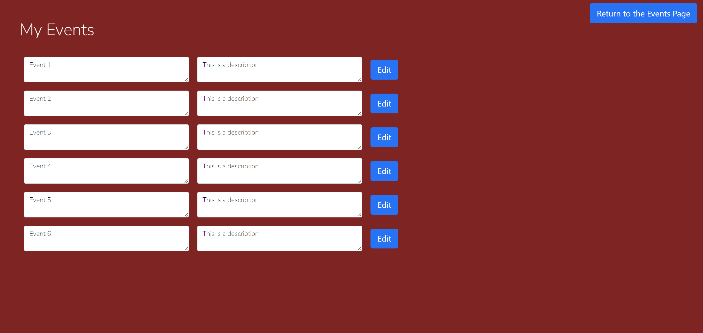
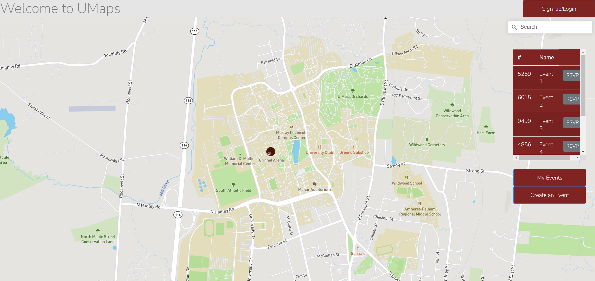

# Part 0: Project API Planning
- API manual:


- End point details:

**Event Object** - 7 fields: Host ID, Host Name, Event ID, Event Title, Description, Location, Time, Images, List of attendees  
```
//event object structure  
let event = {  
    host_id: "",  
    host_name: "",
    event_id: "",  
    event_name: "",  
    event_desc: "",  
    event_location: "",  
    event_time: "",  
    images: "",  
    attendees: [],  
    is_event: true  
}  
```
**User Object** - 6 fields: User ID, Name, UMass Email, Password, List of events created  
```
//user object structure
let user = {
    user_id: "",
    user_name: "",
    user_email: "",
    password: "",
    events: [], //array of event ids
    is_event: false
};
```
**Created** - Relationship between an event and a user, belongs to User. Contains event ID and User ID.  
**RSVPed** - Relationship between an event and a user, belongs to Event. Contains event ID and User ID.  


API Calls:  
/login: allows user to login  
/logout: log out user  
/client/newUser: registering a new user  
/client/getUserbyID: gets user profile(including all events created and attending)  
/client/createEvent: creates a new event  
/client/deleteEvent: deletes an event  
/client/editEvent: updates an event  
/client/getEventbyId: return all information about event  
/client/getAttendees: show all attendees to an event  
/client/attendEvent: marks this user as attending this event  
/client/dumpEvents: returns all events for a user  
 


# Part 2: Front-end Implementation

- Event Creator Page:


This is the event creator page, where users can create new events, update events previously created by them or delete their events. This page showcases Create, Update and Delete operations.

- My Events page:


After we have implemented authorization, this page will be able to show all the events created by the particular user. Currently it just shows all the events stored in the JSON file. This page showcases the Read operation.

- Sign Up Page:


This is the sign up page, where a new user can sign up and make their account (a new user can be created). This page showcases the Create operation.

- Map Page:


The main map page has a list of all events stored in the server, through which a user can find and RSVP for any event. This page showcases the Read operation.


# Part 3: Deployment
Our website has been deployed to Heroku and can be accessed through the following link:
https://cs326-final-umap.herokuapp.com/


# Breakdown of Division of Labor
- Rishab:
Front end implementation. Debugging with postman. API documentation. Worked on milestone2 document.

- Paul:
Front end implementation. Some CRUD functions in server.js. API documentation. Worked on milestone2 document. Deployed web app on Heroku

- Alex:
ExpressJS CRUD functions in server.js. API documentation. Worked on milestone2 document. Some front end implementation.

- Suyash:
Database.js file. CRUD functions in server.js. API documentation. Worked on milestone2 document. Debugging with postman.